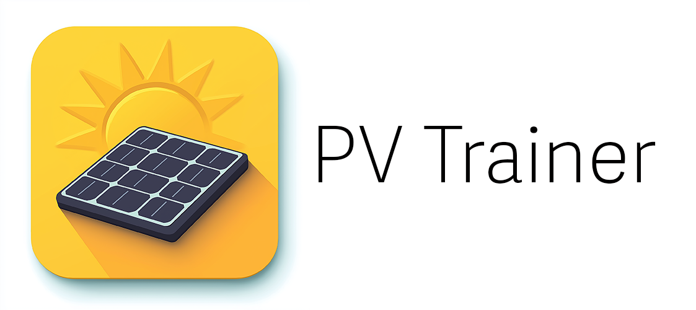

# PV Trainer Repository

Welcome to the official **PV Trainer** module data repository. This repository stores the CSV file used by the PV Trainer app to simulate IV curves and other functionalities related to photovoltaic modules. The CSV contains detailed information about different solar modules and is regularly updated by the community.

**Overview**

This repository serves as the source for all photovoltaic module and inverter data used in the PV Trainer app. The app retrieves this CSV to enable module simulations, IV curve calculations, and more.

Additionally, the app integrates **irradiation data from PVGIS** (Photovoltaic Geographical Information System) based on the user’s location, as well as real-time **stock market data from SMARD** to provide a comprehensive analysis of solar energy performance and market conditions.

**Link PVGIS:** [https://joint-research-centre.ec.europa.eu/photovoltaic-geographical-information-system-pvgis_en]

**Link SMARD:** [https://www.smard.de/home/downloadcenter/download-marktdaten/]


### If you have a solar module that is not currently listed, feel free to request it to be added.

CSV Structure

The CSV file follows a specific format to ensure compatibility with the app. Each row in the CSV represents one solar module with the following fields:

| Field Name  | Description |
| ------------- | ------------- |
| Name  | Module name  |
| Manufacturer  | Manufacturer’s name  |
| Technology  | Solar cell technology (e.g., Mono-c-Si, Multi-c-Si, CdTe, etc.)  |
| Bifacial  | Indicates if the module is bifacial (Yes/No)  |
| STC  | Standard Test Conditions (STC) Power [W]  |
| PTC  | Performance Test Conditions (PTC) Power [W]  |
| A_c  | Module area [m²]  |
| Length  | Length of the module [m]  |
| Width  | Width of the module [m]  |
| N_s  | Number of cells in series  |
| I_sc_ref  | Short-circuit current [A]  |
| V_oc_ref  | Open-circuit voltage [V]  |
| I_mp_ref  | Maximum power current [A]  |
| V_mp_ref  | Maximum power voltage [V]  |
| alpha_sc  | Temperature coefficient of short-circuit current [A/°C]  |
| beta_oc  | Temperature coefficient of open-circuit voltage [V/°C]  |
| T_NOCT  | Nominal operating cell temperature (NOCT) [°C]  |
| gamma_r  | Temperature coefficient of maximum power [%/°C]  |
| Version  | The version or date of the module specification  |


# How to Add a New Module

	1.	Create an Issue: If you want to add a new solar module, create a GitHub Issue in this repository. In your issue, provide the complete details of the module following the format mentioned above.
	2.	Provide Accurate Data: Please ensure that all data is accurate and comes from a reliable source, such as the module’s manufacturer datasheet.
	3.	Review and Approval: Once submitted, the module will be reviewed and, if approved, added to the CSV file.

### How to Report Issues

If you find an error in the module data or have other suggestions, feel free to open an issue in the repository. We will review the reported issue and make corrections if necessary.

### Download the CSV

You can always download the latest version of the module CSV from the repository. This file is continuously updated based on the community’s contributions.

### Example CSV Entry

Here’s an example of how the data should look in the CSV file:
Name,Manufacturer,Technology,Bifacial,STC,PTC,A_c,Length,Width,N_s,I_sc_ref,V_oc_ref,I_mp_ref,V_mp_ref,alpha_sc,beta_oc,T_NOCT,gamma_r,Version
Amerisolar AS-6M-335W,Amerisolar,Mono-c-Si,No,335.0,310.0,1.941,1.956,0.992,72,9.12,45.75,8.66,37.85,0.0046,-0.119,47.5,-0.41,2021

### Use Your Own Custom CSV or Switch to NREL SAM´s CSV
In addition to using the default CSV provided in this repository, the <b>PV Trainer app</b> also allows you to <b>use your own custom CSV file</b> or switch to the <b>NREL SAM CSV file</b>.

How to use your own CSV file:

	1.	Create your own CSV file with the same format as described in this README.
	2.	Host the CSV file on a GitHub repository or another accessible URL.
	3.	In the PV Trainer app, go to the menu and enter the link to your CSV file. The app will load your custom CSV file instead of the default one.

**How to switch to NREL SAM’s CSV:**

If you prefer to use the **NREL SAM CSV file** instead of the default CSV from this repository:

	1.	Go to the menu in the PV Trainer app.
	2.	Select the option to use the NREL SAM CSV.
	3.	The app will then automatically switch to using the module data from NREL’s SAM library, available at this.
 Link: [https://raw.githubusercontent.com/NREL/SAM/develop/deploy/libraries/CEC%20Modules.csv]

By providing flexibility, users can choose between the default module data, their own custom modules, or the official NREL SAM database.

**Explanation fo Allowed Cell Type**
The cell type (Technology) is a crucial field in the module data, as it defines the type of photovoltaic technology used in a given module. Each module can belong to one of the **allowed cell types**, which ensures compatibility with the simulation calculations.

Here is a list of **allowed cell types** and their corresponding mappings to different technology names:
```ruby
ALLOWED_CELLTYPES = ["monoSi", "multiSi", "polySi", "cis", "cigs", "cdte", "amorphous"]

TECHNOLOGY_MAPPING = {
    # Monocrystalline Silicon
    "Mono-c-Si": "monoSi",
    "Mono-cSi": "monoSi",
    "Monocrystalline Silicon": "monoSi",
    "Mono-Si": "monoSi",
    "Mono c-Si": "monoSi",
    "Monocrystalline": "monoSi",
    "Mono-crystalline": "monoSi",
    # Multicrystalline Silicon
    "Multi-c-Si": "multiSi",
    "Multi-cSi": "multiSi",
    "Multicrystalline Silicon": "multiSi",
    "Multi-Si": "multiSi",
    "Multi c-Si": "multiSi",
    "Multicrystalline": "multiSi",
    "Multi-crystalline": "multiSi",
    # Polycrystalline Silicon
    "Poly-c-Si": "polySi",
    "Poly-cSi": "polySi",
    "Polycrystalline Silicon": "polySi",
    "Poly-Si": "polySi",
    "Poly c-Si": "polySi",
    "Polycrystalline": "polySi",
    "Poly-crystalline": "polySi",
    # Amorphous Silicon
    "Amorphous Silicon": "amorphous",
    "a-Si": "amorphous",
    "Amorphous": "amorphous",
    "Amorphous Silicon (a-Si)": "amorphous",
    # Cadmium Telluride
    "CdTe": "cdte",
    "Cadmium Telluride": "cdte",
    "Cadmium-Telluride": "cdte",
    # Copper Indium Diselenide
    "CIS": "cis",
    "Copper Indium Diselenide": "cis",
    "Copper-Indium-Diselenide": "cis",
    # Copper Indium Gallium Diselenide
    "CIGS": "cigs",
    "Copper Indium Gallium Diselenide": "cigs",
    "Copper-Indium-Gallium-Diselenide": "cigs",
    # Other Technologies
    "HIT": "monoSi",  # HIT cells are based on monocrystalline Si with a thin amorphous layer
    "Heterojunction": "monoSi",
    "Perovskite": "amorphous",  # No exact equivalent, but can be adapted
    "DSC": "amorphous",  # Dye-Sensitized Cells can be considered amorphous
    # Additional technologies can be added as needed
}
```

**Contributions**

We welcome contributions from anyone who is passionate about solar energy and photovoltaics. Please follow the guidelines provided when adding or modifying module data.

Thank you for helping us improve the PV Trainer app and for supporting solar energy research!

**Let me know if you’d like to modify anything or if you need further assistance.**
