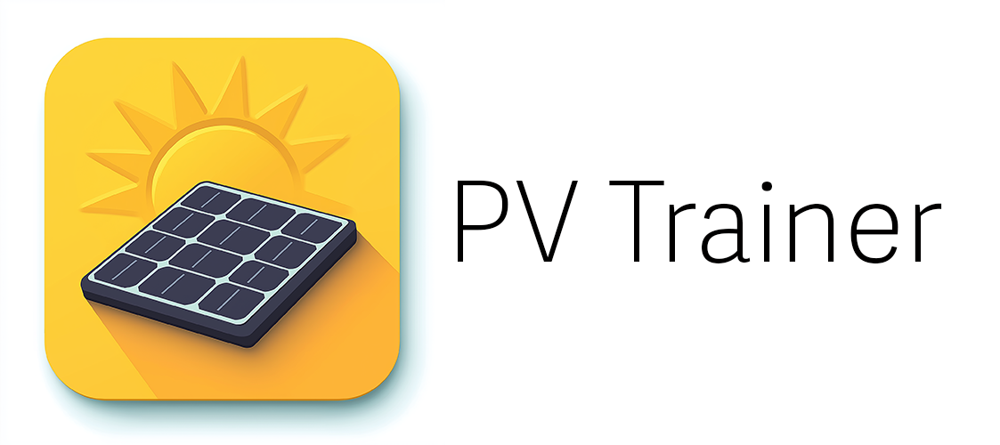

# PV Trainer

**PV Trainer** is an iOS &amp; iPadOS app for planning, simulating and analysing photovoltaic (PV) systems. This repository is the public **information hub** for the app: it documents what the app can do, hosts reference data and is the place to **suggest missing PV modules** for the module database.

> ⚠️ **Disclaimer:** PV Trainer is an educational tool. All results are **rough guide values** meant to give you a **feel for how a PV system behaves** — they are **not an engineering-grade simulation** and are **not binding for planning decisions**. Always rely on professional planning and manufacturer data for real projects.

---

## What the app can do

- **Irradiation (PVGIS):** Pick a location on the map, set tilt (slope), azimuth and year range, and fetch solar irradiation data from **PVGIS**. This is the basis for all yield calculations.
- **Module library:** Choose from thousands of PV modules from an online database. **Search** by name/manufacturer and **filter** by power (Wp) and manufacturer.
- **IV curve:** Display the current–voltage characteristic of a module under different irradiance/temperature conditions, with a readable grid and the power at the maximum power point (MPP).
- **IV diagnosis (Fluke-style):** Compare a **measured sweep** against the model curve to identify typical fault patterns. Six ready-to-load templates are included: *steps/notches, low Isc, low Voc, high series resistance (Rs), low shunt resistance (Rsh)* and *rounded knee*. You get findings (with severity), likely causes, a recommendation and key figures.
- **Specific annual yield:** Estimate the expected annual energy yield from the selected module, module count and inverter efficiency — updated live.
- **Economics:** Compare your consumption (people in the household, heat pump, e-car, home office) with the PV yield. Optional **battery** and editable **tariffs** (electricity price &amp; feed-in). Results include self-consumption, self-sufficiency, savings and **avoided CO₂** — with charts and a monthly profile. The calculation runs **on device** using an hourly simulation with typical load profiles.
- **Yield analysis:** Evaluate the deviation between measured and modeled yield (RMSE, MBE, MAE, nRMSE, R²), with residuals and error grouped by irradiance.
- **PV Trainer Pro:** Some advanced features are available via the optional **PV Trainer Pro** subscription.

Data sources are integrated directly: **PVGIS** (irradiation), **SMARD** (electricity market data) and the PV Trainer module database.

---

## Suggest a missing module

If a module isn't in the database yet, you can suggest it. **Only datasheet values are required** — the CEC single-diode parameters are computed automatically on the server.

**Two ways to submit:**

1. **In the app (easiest):** `Settings → Contribute → Report a missing module`. This opens a pre-filled email to `info@pv-trainer.de` in the format below.
2. **GitHub issue:** Open a new issue in this repository using the **“Module suggestion”** template.

### Required datasheet values

| Field | Description |
| --- | --- |
| `name` | Module name (unique, as it should appear) |
| `manufacturer` | Manufacturer’s name |
| `celltype` | One of: `monoSi`, `multiSi`, `polySi`, `cis`, `cigs`, `cdte`, `amorphous` |
| `V_mp` | Voltage at MPP [V] |
| `I_mp` | Current at MPP [A] |
| `V_oc` | Open-circuit voltage [V] |
| `I_sc` | Short-circuit current [A] |
| `alpha_sc` | Temperature coefficient of I_sc [A/°C] — if the datasheet gives %/°C: `%/100 × I_sc` |
| `beta_voc` | Temperature coefficient of V_oc [V/°C] — usually negative; if %/°C: `%/100 × V_oc` |
| `gamma_pmp` | Temperature coefficient of P_max [%/°C] — usually negative |
| `cells_in_series` | Number of cells in series |
| `source` | Datasheet link (optional) |

Please make sure all values come from a reliable source (e.g. the manufacturer’s datasheet). Submissions are reviewed manually before they are added.

---

## Allowed cell types

The cell type defines the PV technology and must map to one of the allowed values below. Many common names are recognised automatically:

```ruby
ALLOWED_CELLTYPES = ["monoSi", "multiSi", "polySi", "cis", "cigs", "cdte", "amorphous"]

TECHNOLOGY_MAPPING = {
    # Monocrystalline Silicon
    "Mono-c-Si": "monoSi",
    "Mono-cSi": "monoSi",
    "Monocrystalline Silicon": "monoSi",
    "Mono-Si": "monoSi",
    "Mono c-Si": "monoSi",
    "Monocrystalline": "monoSi",
    "Mono-crystalline": "monoSi",
    # Multicrystalline Silicon
    "Multi-c-Si": "multiSi",
    "Multi-cSi": "multiSi",
    "Multicrystalline Silicon": "multiSi",
    "Multi-Si": "multiSi",
    "Multi c-Si": "multiSi",
    "Multicrystalline": "multiSi",
    "Multi-crystalline": "multiSi",
    # Polycrystalline Silicon
    "Poly-c-Si": "polySi",
    "Poly-cSi": "polySi",
    "Polycrystalline Silicon": "polySi",
    "Poly-Si": "polySi",
    "Poly c-Si": "polySi",
    "Polycrystalline": "polySi",
    "Poly-crystalline": "polySi",
    # Amorphous Silicon
    "Amorphous Silicon": "amorphous",
    "a-Si": "amorphous",
    "Amorphous": "amorphous",
    "Amorphous Silicon (a-Si)": "amorphous",
    # Cadmium Telluride
    "CdTe": "cdte",
    "Cadmium Telluride": "cdte",
    "Cadmium-Telluride": "cdte",
    # Copper Indium Diselenide
    "CIS": "cis",
    "Copper Indium Diselenide": "cis",
    "Copper-Indium-Diselenide": "cis",
    # Copper Indium Gallium Diselenide
    "CIGS": "cigs",
    "Copper Indium Gallium Diselenide": "cigs",
    "Copper-Indium-Gallium-Diselenide": "cigs",
    # Other Technologies
    "HIT": "monoSi",          # HIT cells are monocrystalline Si with a thin amorphous layer
    "Heterojunction": "monoSi",
    "Perovskite": "amorphous", # no exact equivalent, adapted
    "DSC": "amorphous",        # Dye-sensitized cells treated as amorphous
}
```

---

## Data sources

- **PVGIS** – Photovoltaic Geographical Information System, © European Union, Joint Research Centre (JRC)
  <https://joint-research-centre.ec.europa.eu/photovoltaic-geographical-information-system-pvgis_en>
- **SMARD** – electricity market data, © Bundesnetzagentur
  <https://www.smard.de/home/downloadcenter/download-marktdaten/>
- **NREL SAM** – module parameters are based in part on the NREL System Advisor Model (SAM) CEC module database.

---

## Report an issue

Found an error in the module data or have a suggestion? Please open a GitHub issue in this repository. Reports are reviewed and corrected where needed.

## Contributing

Contributions from anyone passionate about solar energy are welcome. Thank you for helping to improve PV Trainer and for supporting solar energy! ☀️
